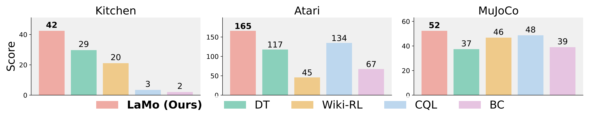
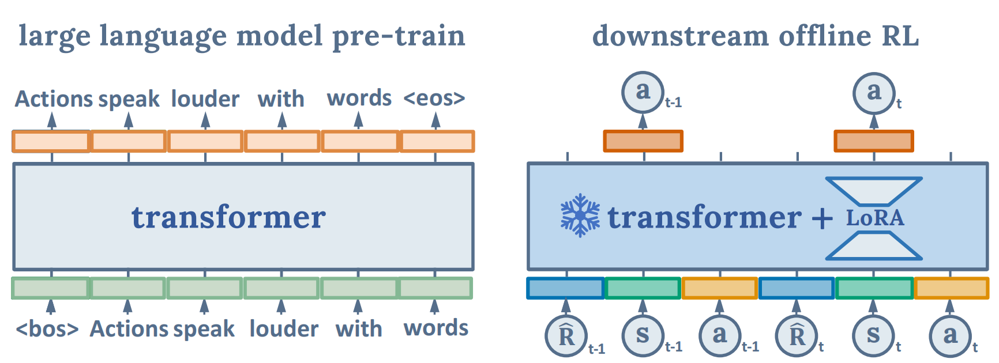

<p align="center">
  <h1 align="center">Unleashing the Power of Pre-trained Language Models for Offline Reinforcement Learning</h1>
</p>

[](https://www.pytorch.org)
[](https://arxiv.org/abs/2310.20587)
[](https://x.com/arankomatsuzaki/status/1719533721794019506?s=20)
[](https://github.com/srzer/LaMo-2023/blob/master/LICENSE)

This repo is the official code release for the ICLR 2024 conference paper:
<p align="center">&nbsp;<table><tr><td>
    <p align="center">
    <strong>
        <a href="https://lamo2023.github.io">
            Unleashing the Power of Pre-trained Language Models for Offline Reinforcement Learning
        </a><br/>
    </strong>
    Ruizhe Shi*<sup>1</sup>, Yuyao Liu*<sup>1</sup>, Yanjie Ze<sup>2</sup>, Simon Shaolei Du<sup>3</sup>, Huazhe Xu<sup>124</sup><br>
    <b>The International Conference on Learning Representations (ICLR) 2024</b><br>
    <sup>1</sup><em>Tsinghua Universtiy, IIIS&nbsp;&nbsp;</em>
    <sup>2</sup><em>Shanghai Qi Zhi Institute&nbsp;&nbsp;</em>
    <sup>3</sup><em>University of Washington&nbsp;&nbsp;</em>
    <sup>4</sup><em>Shanghai AI Lab</em><br>
    *Equal contribution. Order is decided by coin flip.
    </p>
</td></tr></table>&nbsp;</p>


# 🧾 Introduction
We propose **LaMo**, an offline RL framework that leverages the pre-trained **La**nguage Models (LMs) for low-level **Mo**tion control. On sparse-reward tasks, **LaMo** achieves strong results and surpasses recent strong algorithms CQL, IQL, TD3+BC, and DT; On dense-reward tasks, **LaMo** significantly improves Decision Transformer and closes the gap between value-based methods and DT-based methods. Notably, in low-data scenarios, our method demonstrates powerful few-shot learning ability, which can be attributed to the inductive bias from pre-trained LMs.

<p align="center">
  
  
</p>

We look into the relationship between the performance of various algorithms and the scale of data. As depicted in the Figure, **LaMo** is capable of achieving excellent performance even with relatively small datasets. For example, in Hopper, **LaMo** surpasses the performance of CQL and DT when the sample ratio of data is **0.5%** and maintains this advantage consistently as the sample ratio increases.

Below, we visualize **8** tasks across **3** domains that we consider.
- D4RL
  - MuJoCo: Hopper, Walker2d, HalfCheetah, Reacher2d
  - Kitchen
- Atari: Breakout, Qbert, Pong
<p align="center">
  
</p>

# 💻 Installation
## D4RL
### Environment
#### Install MuJoCo
First, you need to download the file from this [link](https://mujoco.org/download/mujoco210-linux-x86_64.tar.gz) and `tar -xvf the_file_name` in the `~/.mujoco` folder. Then, run the following commands.
```bash
cd experiment-d4rl
conda env create -f env.yml
```
After that, add the following lines to your `~/.bashrc` file:
```bash
export LD_LIBRARY_PATH=$LD_LIBRARY_PATH:/YOUR_PATH_TO_THIS/.mujoco/mujoco210/bin
export LD_LIBRARY_PATH=$LD_LIBRARY_PATH:/usr/lib/nvidia
```
Remember to `source ~/.bashrc` to make the changes take effect.

#### Install D4RL
Install D4RL by following the guidance in [D4RL](https://github.com/Farama-Foundation/D4RL).

### Dataset
To download original D4RL data, 
```bash
cd data
python download_d4rl_datasets.py
```

To get downsampled data, you need to modify line 10 of 'data/mujoco/ratio_dataset.py' and line 10 of 'data/kitchen/ratio_dataset.py' as 
```python
suffix = [your data version name]
```
and then run
```bash
cd data
cd mujoco
python ratio_dataset.py
cd ..
cd kitchen
python ratio_dataset.py
cd ..
```

Besides, you can directly get our pre-processed data in [this link](https://drive.google.com/drive/folders/1c3htmB0bCixakM12EmDG4Qr3nMihrj6t?usp=sharing). 

You can also try generating the data using a PPO agent trained by yourself, as provided in ‘data/data_generation_PPO’.

## Atari
### Environment
First make sure you have the dependencies to install Atari.
```bash
sudo apt install cmake
sudo apt install zlib1g-dev
```
Then run the following commands.
```bash
cd experiment-atari
conda env create -f env.yml
```
### Dataset
The dataset will be downloaded automatically and cached locally by the package [d4rl-atari](https://github.com/takuseno/d4rl-atari) once you launch an experiment. To reproduce our results of downsampled datasets, you can set the seed to be identical to ours (3 seeds, 0, 1, and 2), and our implementation of ``experiment-atari/buffer.py`` will make sure that the downsampled dataset will also be identical to ours. 

# 🛠️ Usage 
## D4RL
After installing the packages and data, to reproduce our results on D4RL, you only need to run
```bash
cd experiment-d4rl
bash run.sh [env_name] [dataset_name] [sample_ratio] [description] [seed] [gpu]
```

An example is:
```bash
bash run.sh hopper medium 0.1 reproduce 0 0
```

If you want to view results on [Weights & Biases](wandb.ai), you need to modify line 435, 436 of '/code/experiment.py' as:
```python
entity=[your-group-name],
project=[your-project-name],
```

Trying more configurations is encouraged! Important arguments are explained as below:

```bash
-w # enable wandb
--sample_ratio your_sample_ratio # determine the size of the data you are training on, like 0.1
--data_suffix your_data_version_name # you could downsample the data by yourself, default is "d1"
--mlp_embedding # use MLP as embeddings and projections
--adapt_mode # otherwise fully fine-tuning
--adapt_embed # fine-tune embeddings and projections when adapt_mode is ON
--lora # fine-tune low rank matrices of Transformer when adapt_mode is ON
--pretrained_lm language_model_name # you could try 'gpt2' and 'gpt2-medium'
--co_training # use language loss as auxiliary objective
--co_lambda # the weight of language loss, like 0.1
```
We provided all scripts in [this link](https://drive.google.com/drive/folders/1c3htmB0bCixakM12EmDG4Qr3nMihrj6t?usp=sharing). 

## Atari 

To reproduce our results on Breakout with one click, run the following commands
```bash 
cd experiment-atari
bash run.sh 
```
Since we use [Hydra](https://hydra.cc/) to manage the configuration of the experiments on Atari, you can overwrite hypermeters conveniently. If you want to run experiments on more environments, add the configuration for the corresponding environment under ``experiments-atari/cfgs/env``. Refer to the [documentation](https://hydra.cc/docs/intro/) of Hydra for more details. Here are a few important hyperparameters:
```bash 
env # environment name (breakout, qbert, pong, or any atari environment you want to explore)
pretrained_lm # gpt2, gpt2-medium or none
seed # 0, 1, 2
sample_ratio # the ratio of dataset you train on
model.random_initialize # randomly initialize the weight of the model (overwrite the pretrained weight) or not 
model.adapt_cfg.use_adapt # use adapt mode or not (relative to fully finetune)
model.adapt_cfg.adapt_embed # unfreeze embedding or not 
model.lora_cfg.use_lora # use lora or not
model.lora_cfg.lora_attn_dim # the dimension of lora
model.context_len # the context length of the transformer model
train.lr # learning rate
train.weight_decay # weight decay
train.batch_size # batch size
nlp_train.co_training # use language joint training or not
nlp_train.co_lambda # the weight of language joint training loss
```
# 🙏 Acknowledgement
**LaMo** is based on many open-source projects, including [Decision Transformer](https://github.com/kzl/decision-transformer), [Can Wikipedia Help Offline Reinforcement Learning](https://github.com/machelreid/can-wikipedia-help-offline-rl), [LoRA](https://github.com/microsoft/LoRA), [DeFog](https://github.com/hukz18/DeFog), [d4rl-atari](https://github.com/takuseno/d4rl-atari). We thank all these authors for their nicely open sourced code and their great contributions to the community.

# 🏷️ License
**LaMo** is licensed under the MIT license. See the [LICENSE](LICENSE) file for details.

# 📝 Citation
If you find our work useful, please consider citing:
```
@article{Shi2024LaMo,
  title={Unleashing the Power of Pre-trained Language Models for Offline Reinforcement Learning},
  author={Ruizhe Shi and Yuyao Liu and Yanjie Ze and Simon S. Du and Huazhe Xu},
  journal={International Conference on Learning Representations}, 
  year={2024}
}
```